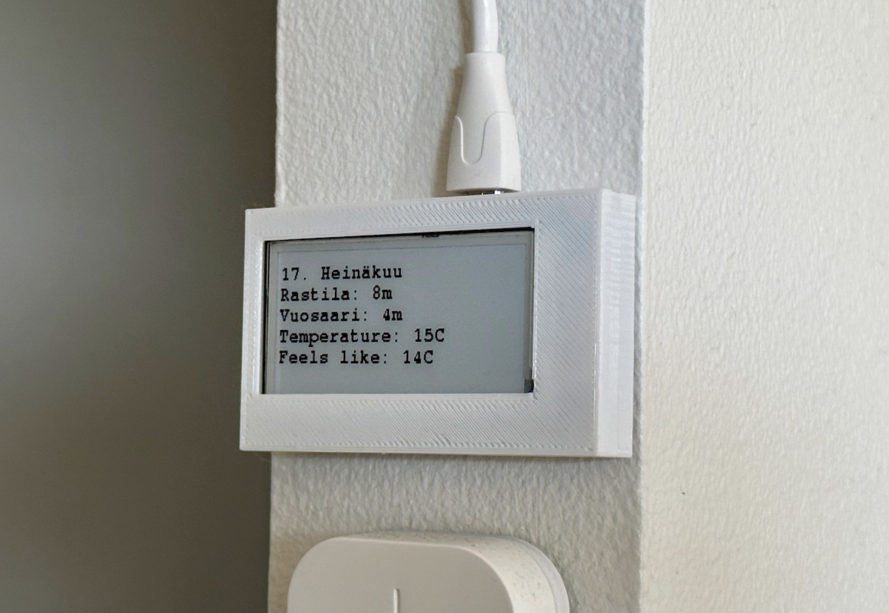

# E-Ink home dashboard

This project showcases the code for my personalized home dashboard, which runs on the [LilyGo T5 V213](https://www.lilygo.cc/products/t5-2-13inch-e-paper) device with an e-ink display.



## Intro

The Home Dashboard project was initially created to serve my specific use-case, and as a result, there are a few hardcoded constants in certain sections of the code. However, these constants are straightforward to replace, and you can easily add new data sources by following the examples provided for the existing ones. Feel free to copy and modify it to your liking.

## Features so far

- Current date display (includes the month in Finnish to facilitate language practice)
- Bus arrival times for two directions in Helsinki using the [DigitTransit Routing API](https://digitransit.fi/en/developers/apis/1-routing-api/)
- Outdoor temperature (The temperature is obtained using the free API provided by [wttr.in](https://wttr.in). However, it's worth mentioning that this API can be occasionally inaccurate in certain cases.)


## Getting started

1. Get PlatformIO for VSCode: [https://platformio.org](https://platformio.org)

PlatformIO automatically fetches the dependencies of the project, and manages the building and installation of the software.

2. Create a header file in the `/include` directory called as `secrets.h` with the following content:

```
#define WIFI_SSID "..."
#define WIFI_PASSWORD "..."
#define HSL_API_KEY "..."
#define STATION_A_ID ...
#define STATION_B_ID ...
#define STATION_A_DIRECTION "..."
#define STATION_B_DIRECTION "..."
```

You can request a key for the HSL journey planning API on the website of `digitransit.fi`.
More information at: [https://digitransit.fi/en/developers/api-registration/](https://digitransit.fi/en/developers/api-registration/)

3. Plug in the board, build and upload with PlatformIO.

And that's it! Hope you find it useful as a reference for similar dashboard implementations.

_If you liked this project, check out my other software at: [https://headprocess.com](https://headprocess.com)_